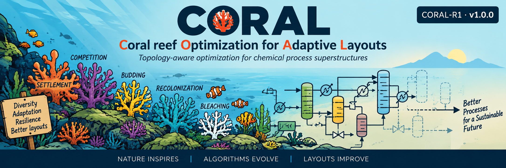

<p align="center">
  
</p>

# CORAL

**Coral reef Optimization for Adaptive Layouts**

CORAL is a hybrid topology-search/NLP framework for chemical process superstructure optimization. It combines coral-reef-inspired structural exploration with deterministic constrained nonlinear programming for continuous design-variable refinement.

This repository contains **CORAL-R1**, the frozen and reproducible research version associated with the first systematic process-superstructure study of the framework, together with clearly separated additional experiments introduced during peer review.

> **The original CORAL-R1 implementation and computational evidence are preserved as a research release.**  
> Additional experiments introduced during peer review are retained separately under `reviewer_response/`, without modifying the original frozen R1 implementation or results. Future development of CORAL may extend the ecological mechanisms, computational architecture, and application scope.

---

## Concept

CORAL treats alternative process structures as competing species on a computational reef.

A candidate solution consists of:

- a discrete process topology, **y**;
- continuous design variables, **x**;
- an objective value;
- feasibility information.

The reef provides a finite computational environment in which candidate structures can settle, reproduce, compete, disappear, and recolonize.

The biological analogy is used to organize structural search:

| Reef ecology | CORAL interpretation |
|---|---|
| Reef | Computational population |
| Coral colony | Candidate process design |
| Species | Process topology |
| Settlement | Introduction of a candidate |
| Budding | Local generation of related candidates |
| Competition | Selection under limited population capacity |
| Depredation | Removal of poor candidates |
| Bleaching / disturbance | Deliberate population disruption |
| Recolonization | Introduction of new structural diversity |
| Diversity | Coexistence of alternative topologies |
| Local refinement | Constrained nonlinear optimization |

CORAL is **inspired by coral-reef ecology**, rather than intended as a biologically faithful reef model.

---

## Optimization architecture

CORAL separates structural exploration from continuous optimization.

```text
                    CORAL reef
                        |
                        v
              discrete topology search
                        |
                        v
                 topology repair
                        |
                        v
              fixed process topology
                        |
                        v
          constrained local NLP refinement
                 (fmincon / SQP)
                        |
                        v
             feasibility + objective
                        |
                        v
             return candidate to reef
```

The reef therefore explores the discrete structural space, while deterministic constrained nonlinear programming refines the continuous variables for promising fixed topologies.

This hybrid topology-search/NLP architecture is the central feature of CORAL-R1.

The computational results indicate that, on the benchmark considered here, the constrained NLP component is decisive for reliable feasibility and solution quality. The reef-specific mechanisms provide one realization of the structural-search layer, but are not claimed to outperform simpler structural-search strategies on this benchmark.

---

## CORAL-R1

CORAL-R1 is the frozen implementation corresponding to the first systematic computational validation of the framework.

The original R1 release includes:

- the CORAL-R1 optimizer;
- a reproducible eight-process synthesis benchmark;
- deterministic reference enumeration;
- component-ablation experiments;
- equal-oracle-budget comparisons;
- GA and GA+local-NLP baselines;
- local-NLP probability and intensity studies;
- parameter and reef-size sensitivity studies;
- raw computational results;
- consolidated statistical tables and figures;
- documentation for reproducing the experiments.

The frozen release is tagged:

**v1.0.0 — CORAL-R1**

Experiments added subsequently in response to peer review are stored separately under `reviewer_response/`. They do not replace or modify the frozen R1 evidence.

---

## Eight-process synthesis benchmark

The principal validation case is the classical eight-process process-network synthesis problem.

The deterministic reference calculation enumerates all **12 logically admissible process topologies** and solves the continuous nonlinear subproblem using multistart SQP.

Reference solution:

```text
Objective value:     68.009744051065
Selected processes:  2, 4, 6, 8
```

This deterministic reference is used as the numerical benchmark for the CORAL-R1 experiments.

### Benchmark provenance

The eight-process synthesis problem is an established benchmark in process systems engineering and was not developed specifically for CORAL.

The problem originates from the process-network synthesis work of Duran and Grossmann and was subsequently used by Türkay and Grossmann in the development of logic-based MINLP methods. The CORAL-R1 benchmark implementation follows the structure of the publicly available GAMS Model Library `LOGMIP3` formulation, **Synthesis of 8 Processes**.

The known reference solution selects processes **2, 4, 6, and 8**, with an objective value of approximately **68.01**. The independent deterministic enumeration included in CORAL-R1 reproduces this solution as:

```text
Objective value:     68.009744051065
Selected processes:  2, 4, 6, 8
```

Key literature:

- Duran, M.A. (1984). *A Mixed-Integer Nonlinear Programming Approach for Process Systems Synthesis*. PhD thesis, Carnegie Mellon University.
- Türkay, M.; Grossmann, I.E. (1996). “Logic-based MINLP algorithms for the optimal synthesis of process networks.” *Computers & Chemical Engineering*, 20(8), 959–978.

The public benchmark formulation is available from the GAMS Model Library as:

**LOGMIP3 — Synthesis of 8 Processes**  
https://www.gams.com/latest/gamslib_ml/libhtml/gamslib_logmip3.html

---

## Main computational findings

The computational study and the additional reviewer-response experiments support five main conclusions.

### 1. CORAL-R1 robustly recovers the reference topology

In the principal 30-run experiment, CORAL-R1 obtained feasible solutions in **30/30 runs** and recovered the reference process topology **2–4–6–8 in 30/30 runs**.

The median raw objective was approximately:

```text
68.00974405
```

and deterministic final polishing recovered the reference objective to numerical precision.

### 2. Hybridization with constrained NLP is essential

Experiments without local constrained NLP refinement generally failed to obtain continuous feasibility on the eight-process problem.

When structural search was coupled to deterministic constrained NLP refinement, CORAL, CRO-like search, and GA-based search could recover feasible high-quality solutions under the tested conditions.

These experiments identify the coupling of structural exploration with deterministic constrained continuous optimization as the main mechanism responsible for robust performance.

### 3. The reef-specific mechanisms do not demonstrate superiority

On this relatively small benchmark, the topology-aware ecological mechanisms of CORAL-R1 did **not** demonstrate superiority over simpler hybrid structural-search approaches.

In the equal-budget comparison, the simpler CRO-like+NLP approach obtained the same feasibility and topology-recovery performance while requiring approximately **12% fewer median oracle calls** than full CORAL.

The results therefore support CORAL-R1 as a **hybrid topology-search/NLP framework and research platform**, rather than as evidence that coral-inspired search universally outperforms alternative optimization methods.

### 4. Topology-aware stopping substantially reduces unnecessary computation

The original CORAL-R1 implementation may continue performing local NLP refinements after the incumbent topology has stabilized.

An additional topology-aware stopping experiment was therefore conducted during peer review using the same 30 random seeds as the original experiment.

The stopping criterion requires:

1. a feasible incumbent;
2. an unchanged incumbent topology for 20 consecutive iterations; and
3. a relative objective change over the same interval no greater than `1e-6`.

The parameters were fixed before the 30-run comparison and were not tuned to individual runs.

Results:

| Metric | Original CORAL-R1 | Topology-aware stopping |
|---|---:|---:|
| Feasible runs | 30/30 | 30/30 |
| Reference-topology recovery | 30/30 | 30/30 |
| Median total oracle calls | 1,447,466 | 378,695 |
| Median local NLP calls | 2,797 | 714 |
| Median termination iteration | — | 21 |

The stopping criterion therefore reduced median total oracle calls by **73.8%** and median local NLP calls by **74.5%**, while preserving 30/30 feasibility and 30/30 recovery of the reference topology.

This experiment indicates that the relevant topology stabilizes substantially earlier than the original generic stagnation criterion terminates the search.

The early-stopping result should not be interpreted as demonstrating superiority over the CRO-like+NLP baseline because the same topology-aware stopping criterion was not applied to that baseline.

### 5. Deterministic global optimization is preferable for this benchmark

During peer review, the eight-process problem was also reformulated algebraically as an MINLP and solved using **BARON**.

The revised deterministic formulation uses analytically justified finite variable bounds and unit-specific big-M constants derived from the benchmark structure. It does not use the artificial blanket bound `X(i) <= 20` employed in an earlier exploratory comparison model.

BARON returned:

| Quantity | Result |
|---|---:|
| Objective | 68.0097429224943 |
| Best possible bound | 68.0097428545 |
| Absolute global gap | 6.7994e-8 |
| Relative global gap | 9.9977e-10 |
| Selected processes | 2, 4, 6, 8 |
| Solver resource usage | 2.520 s |
| Evaluation errors | 0 |

BARON therefore recovers the reference topology and objective while providing a global optimality certificate.

For this small and algebraically explicit benchmark, deterministic global MINLP optimization is clearly preferable to stochastic structural search.

CORAL-R1 should therefore not be interpreted as a replacement for deterministic global optimization when a compact and tractable algebraic MINLP formulation is available.

Potential advantages of topology-aware stochastic structural search may arise for substantially larger structural spaces or problems involving simulation-based, black-box, or otherwise less explicit models. Such advantages are **not demonstrated by the present benchmark** and remain a topic for future investigation.

---

## Repository structure

```text
CORAL-R1/
│
├── CORAL_banner.png
│
├── src/
│   └── CORALSuperstructureOptimizer_R1.m
│
├── examples/
│   └── run_CORAL_R1_eight_process.m
│
├── benchmarks/
│   └── eight_process/
│       ├── eight_process_model.m
│       ├── eight_process_constraints.m
│       ├── eight_process_bounds.m
│       ├── eight_process_logic_feasible.m
│       └── eight_process_topology_repair.m
│
├── experiments/
│   ├── reference_enumeration/
│   ├── components/
│   ├── equal_budget/
│   ├── GA_baselines/
│   ├── localNLP_probability/
│   ├── sensitivity/
│   └── consolidate/
│
├── results/
│   ├── raw/
│   ├── summary/
│   └── figures/
│
├── docs/
│   └── reproducibility.md
│
├── reviewer_response/
│   ├── early_stopping/
│   │   ├── CORALSuperstructureOptimizer_R1_ES.m
│   │   ├── benchmark_CORAL_R1_early_stopping.m
│   │   └── RESULTS.md
│   │
│   └── baron/
│       ├── logmip3_baron_revised.gms
│       ├── logmip3_baron_revised.lst
│       └── README.md
│
├── README.md
├── LICENSE
├── CITATION.cff
├── CHANGELOG.md
└── .gitignore
```

The `localNLP_probability` directory also contains the experiment examining local-NLP iteration intensity.

The `reviewer_response` directory is deliberately separated from the original R1 implementation. It contains experiments introduced during peer review and does not alter the frozen R1 evidence.

---

## Quick start

MATLAB users can start with:

```matlab
run('examples/run_CORAL_R1_eight_process.m')
```

The example:

1. loads the eight-process benchmark;
2. initializes CORAL-R1;
3. activates topology repair and explicit nonlinear constraints;
4. performs topology search with constrained local NLP refinement;
5. reports the final objective, topology, feasibility residuals, and computational counters.

For a complete reproduction of the original computational study, see:

```text
docs/reproducibility.md
```

---

## Reproducing the original R1 study

A logical reproduction sequence is:

1. **Deterministic reference enumeration**
2. **Single CORAL-R1 example**
3. **Local-NLP probability sensitivity**
4. **Component ablation**
5. **Equal-oracle-budget comparison**
6. **GA and GA+local-NLP baselines**
7. **Parameter and reef-size sensitivity**
8. **Local-NLP intensity sensitivity**
9. **Statistical consolidation**

The repository includes frozen output files so that the original numerical evidence can be inspected without rerunning the more computationally expensive campaigns.

---

## Reproducing the reviewer-response experiments

### Topology-aware early stopping

The topology-aware stopping experiment is located in:

```text
reviewer_response/early_stopping/
```

Run:

```matlab
benchmark_CORAL_R1_early_stopping
```

using:

```text
CORALSuperstructureOptimizer_R1_ES.m
```

The experiment uses the same 30 seeds, `12001–12030`, as the principal R1 repeated-run experiment.

A summary of the resulting computational evidence is provided in:

```text
reviewer_response/early_stopping/RESULTS.md
```

### BARON deterministic global comparison

The deterministic global MINLP experiment is located in:

```text
reviewer_response/baron/
```

The GAMS model is:

```text
logmip3_baron_revised.gms
```

The complete solver listing corresponding to the reported calculation is:

```text
logmip3_baron_revised.lst
```

The calculation reported in the revised study used:

- GAMS 40.1.1;
- BARON 22.7.23;
- MINLP optimization;
- a 300 s resource limit.

See:

```text
reviewer_response/baron/README.md
```

for details of the formulation and interpretation.

---

## Computational effort

For comparisons between stochastic algorithms, CORAL-R1 primarily uses **oracle evaluations** rather than wall-clock time.

This is intentional. Wall-clock measurements can depend strongly on hardware, MATLAB configuration, operating-system scheduling, and external computational load.

Oracle counts provide a more reproducible measure of computational effort across the reported stochastic experiments.

Runtime information is retained where available, but should be interpreted as secondary evidence.

The BARON solver resource usage reported above is retained as part of the deterministic solver output, but should not be interpreted as a hardware-independent direct wall-clock comparison with the MATLAB stochastic experiments.

---

## Reproducibility philosophy

CORAL-R1 distinguishes between three categories:

- **frozen R1 research evidence**, corresponding to the original reported computational study;
- **reviewer-response evidence**, consisting of additional experiments introduced during peer review and stored separately;
- **future algorithm development**, which may modify or extend CORAL beyond R1.

The original R1 implementation and results are therefore retained as a stable reference rather than being modified retrospectively.

Reviewer-response experiments are additive and explicitly identified as such.

The aim is that both the original computational claims and the subsequent analyses remain inspectable and reproducible even as the broader CORAL project evolves.

---

## Software requirements

CORAL-R1 is implemented in **MATLAB**.

The original computational study uses:

- **Optimization Toolbox** — constrained nonlinear optimization using `fmincon`;
- **Global Optimization Toolbox** — genetic-algorithm baseline experiments.

No specific MATLAB release is claimed as a requirement.

The deterministic global comparison additionally uses:

- **GAMS**;
- **BARON**.

The archived BARON calculation was performed using GAMS 40.1.1 and BARON 22.7.23.

---

## Results

Frozen computational outputs from the original R1 study are available in:

```text
results/raw/
```

Consolidated statistical tables are available in:

```text
results/summary/
```

Publication-facing figures are available in:

```text
results/figures/
```

These include the component comparison, equal-budget experiments, baseline comparisons, local-NLP sensitivity, and reef-size sensitivity.

Additional results introduced during peer review are retained separately in:

```text
reviewer_response/
```

---

## Interpretation and limitations

The computational evidence supports the following interpretation of CORAL-R1.

CORAL-R1 robustly recovers the reference solution of the eight-process synthesis benchmark under the reported experimental settings.

The experiments show that **constrained local NLP refinement is the decisive mechanism** for reliable feasibility and solution quality on this problem. The reef-specific mechanisms provide a structured population-based approach to topology exploration but do not demonstrate an efficiency advantage over the simpler CRO-like hybrid search on this benchmark.

Topology-aware stopping addresses an inefficiency identified in the original R1 implementation by terminating the search after both structural and objective stabilization.

The deterministic BARON comparison provides an important boundary on the claims that can be made from this benchmark. When the problem is available as a small and tractable algebraic MINLP, deterministic global optimization is the natural and preferable approach.

Consequently, CORAL-R1 should be interpreted as a reproducible **hybrid topology-search/NLP architecture** and as a research platform for studying structural-search mechanisms, rather than as evidence that a reef-inspired metaheuristic is superior to deterministic optimization.

The possible value of topology-aware population search for much larger, simulation-based, black-box, or otherwise less explicit process-superstructure problems remains to be established on appropriate future benchmarks.

---

## Project status

**CORAL-R1 / v1.0.0** is a frozen research release.

The original R1 implementation and computational evidence remain unchanged. The `reviewer_response/` material represents documented extensions of the reproducibility package rather than modifications of the frozen R1 study.

The broader CORAL project remains open to further development. Potential future directions include:

- substantially larger chemical-process superstructures;
- simulation-based and black-box process models;
- richer structural-search mechanisms;
- alternative deterministic local solvers;
- parallel reef evaluation;
- dynamic and uncertain process-design problems;
- deeper investigation of ecological mechanisms;
- collaboration with coral-reef ecologists to explore whether greater ecological fidelity can generate useful new optimization mechanisms.

Such developments should be treated as extensions beyond CORAL-R1 rather than retrospective modifications of the frozen R1 evidence.

---

## Citation

If you use CORAL-R1 in research, please cite the software and the associated publication when available.

Citation metadata are provided in:

```text
CITATION.cff
```

GitHub can generate citation formats directly from this metadata using **Cite this repository**.

For the deterministic global MINLP comparison, the BARON literature should also be cited, including:

Kılınç, M.R.; Sahinidis, N.V. (2018).  
“Exploiting integrality in the global optimization of mixed-integer nonlinear programming problems in BARON.”  
*Optimization Methods and Software*, **33**, 540–562.

---

## Historical CORAL project

CORAL-R1 is the reproducibility repository for the revised CORAL study.

The original CORAL project and its development history are maintained separately at:

https://github.com/zondervanedwin-collab/CORAL

The present revision and reproducibility repository is:

https://github.com/zondervanedwin-collab/CORAL-R1

This separation allows the historical CORAL project to remain available while preserving CORAL-R1 as the reproducible scientific reference for the revised study.

---

## License

CORAL-R1 is released under the **MIT License**.

See `LICENSE` for details.

---

## Author

**Edwin Zondervan**  
Sustainable Process Technology  
University of Twente  
The Netherlands

ORCID: 0000-0003-2659-1622

---

**CORAL — Coral reef Optimization for Adaptive Layouts**

*Nature inspires. Algorithms evolve. Layouts improve.*
